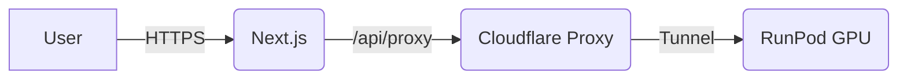

# RunningHub App - Agent Guide

## Project Overview
RunningHub App is a **Serverless AI Image Editing** application. It enables users to upload images and edit them using the **Qwen** AI model running on a remote **ComfyUI** instance (RunPod).

The application uses **Next.js** for the frontend, hosted on **Cloudflare Pages**, and leverages **Cloudflare Functions** as a secure proxy to tunnel requests to the GPU backend.

## Architecture

**Frontend (Edge)**: Next.js App Router, TailwindCSS.
**Proxy (Edge)**: Cloudflare Pages Functions (`functions/api`). Routes traffic to the hidden GPU server.
**AI Backend**: ComfyUI on RunPod, connected via Cloudflare Tunnel.

## Directory Structure

- `src/app/`
    - `page.tsx`: Main UI. Handles state, image preview, and user inputs.
- `src/lib/`
    - `comfyClient.ts`: Key logic. Handles image upload, workflow injection, and polling.
    - `workflow_template.json`: The raw ComfyUI workflow used for generation.
- `functions/api/`
    - `config.ts`: Configures the `TUNNEL_URL`.
    - `proxy/[[path]].ts`: The wildcard proxy that forwards requests to ComfyUI.
- `scripts/`: Utilities for RunPod setup and verification (e.g., `verify_runpod_content.js`).

## Key Workflows

### 1. Image Generation Loop
1.  **Upload**: Image is POSTed to `/api/proxy/upload/image`.
2.  **Prompt**: user prompt & image path are injected into the JSON workflow. POSTed to `/api/proxy/prompt`.
3.  **Poll**: Client polls `/api/proxy/history/{prompt_id}` until status is success.
4.  **View**: Final image is fetched via `/api/proxy/view`.

### 2. Connection Setup
The `TUNNEL_URL` (e.g., `https://...trycloudflare.com`) is stored in Cloudflare KV. It is set via a POST to `/api/config` (typically by a startup script on the GPU node).

## Setup commands
- Install deps: `pnpm install`
- Start dev server: `pnpm dev`
- Run tests: `pnpm test`

## Code style
- **TypeScript**: Strict mode enabled.
- **Formatting**: Single quotes, no semicolons.
- **Patterns**: Functional programming preferred. Avoid class-based components.
