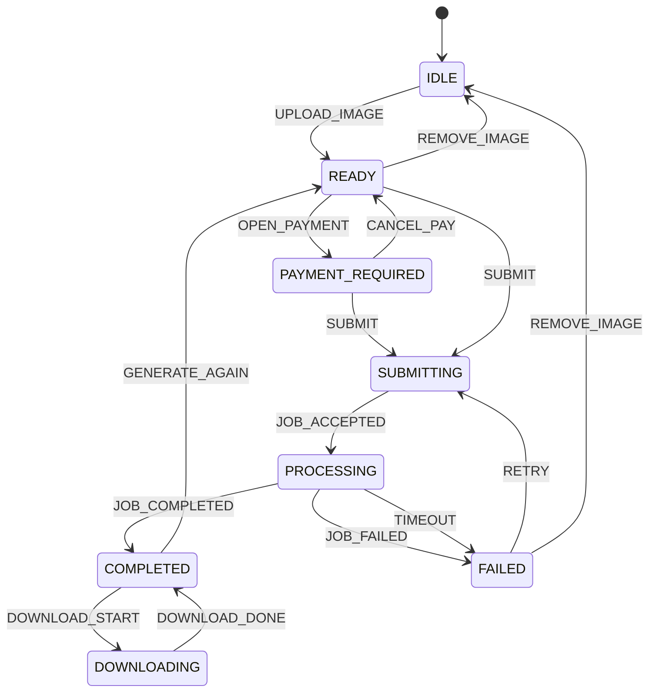

# Qwen Image Edit Frontend State Machine

## Notes
- One-way transitions are enforced; status regression is ignored unless a reset event is used.
- RESET events: REMOVE_IMAGE, GENERATE_AGAIN, CANCEL_PAY.
- DOWNLOADING is a UI-only state to prevent duplicate downloads while the file is prepared.
