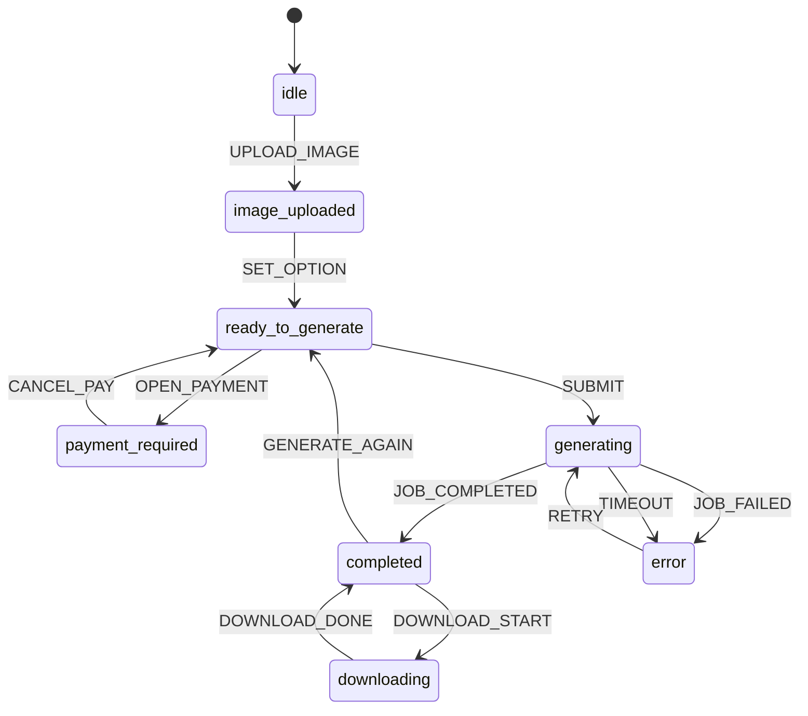

# Frontend State Machine - Qwen Image Edit

## State Labels (Thai)
- idle: พร้อมเริ่ม
- image_uploaded: อัปโหลดแล้ว
- ready_to_generate: พร้อมสร้างภาพ
- payment_required: รอชำระเงิน
- generating: กำลังประมวลผล
- completed: เสร็จแล้ว
- error: เกิดข้อผิดพลาด
- downloading: กำลังดาวน์โหลด

## UI Mapping
- idle: แสดงการตลาด + ปุ่มเริ่มแก้ไขถูกปิดถ้าไม่มีภาพ
- image_uploaded / ready_to_generate: ปุ่มเริ่มแก้ไขพร้อมใช้งาน
- generating: แสดงแผงสถานะและข้อความรอคิว GPU/กำลังประมวลผล
- completed: แสดงผลลัพธ์พร้อมลายน้ำและปุ่มดาวน์โหลด
- error: แสดงข้อความที่เป็นมิตรพร้อมปุ่มลองอีกครั้ง
